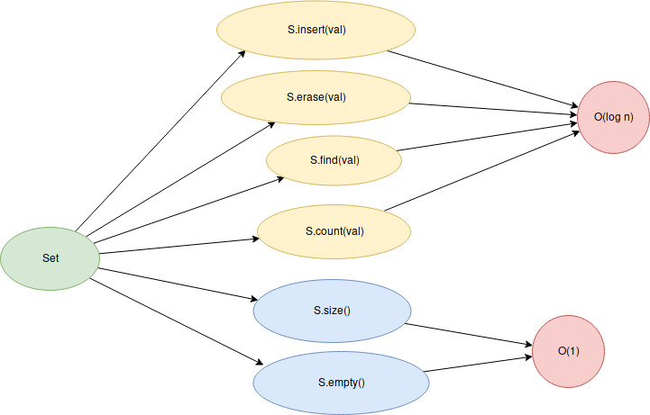

```{r setup, include=FALSE}
htmltools::tagList(rmarkdown::html_dependency_font_awesome())
```

<div class="topic">Complejidad algorítmica: problema motivacional</div>

¿ Cómo podriamos determinar cuánto demorará el siguiente programa (aproximadamente) para cualquier valor de `n` ?

```c++
vector <bool> sieve (int n) {
  vector <bool> is_prime(n, true);
  is_prime[0] = is_prime[1] = false;
  for (int i = 2; i < n; i++) {
    if (!is_prime[i]) continue;
    for (int j = i + i; j < n; j += i) {
      is_prime[j] = false;
    }
  }
  return is_prime;
}
```

[Full code](./code/class-02/sieve.cpp)

Podemos tomar el tiempo que demora en ejecutar para distintos valores de `n`:

|    n    |  time(s) |
| :-----: | :------: |
| 1000000 | 0.099296 |
| 1100000 | 0.092526 |
| 1200000 | 0.098912 | 
| 1300000 | 0.108183 |
| 1400000 | 0.118805 |
| 1500000 | 0.121858 |
| 1600000 | 0.127802 |
| 1700000 | 0.133683 |
| 1800000 | 0.142920 |
| 1900000 | 0.157752 |

Luego podríamos interpolar una función a partir de esos puntos, así
obtendríamos la función `f(x) = tiempo aproximado que demora nuestro programa
cuando n = x`

Sin embargo, hacer todo lo anterior para cada idea que se nos ocurra sería muy
trabajoso, por eso se busca una manera teórica de obtener una buena cota
superior de `f(x)`.

<div class="topic">Notación Big O</div>

### Operaciones básicas

Definamos ciertas operaciones como básicas o fundamentales. Asumiremos que el
tiempo que demoran en ejecutarse cualquiera de ellas es el mismo. Estas
operaciones son:

- Creación y asignacion de una variable
- Operaciones aritméticas
- Llamada de funciones

Ahora nuestro tarea consistirá en encontrar una función
`g(x) = cantidad de operaciones básicas que realiza nuestro programa para n = x`

Así, considerando que nuestra computadora puede realizar aproximadamente $T = 10^8$
operaciones básicas por segundo, podemos decir que

$$f(x) \approx \frac{g(x)}{T}$$

Sin embargo, usualmente `g(x)` tendrá la forma

$$g(x) = a_n x^m + a_{m - 1} x^{m - 1} \dots a_1 x + a_0$$

Pero solo consideraremos el término de mayor grado y no tendremos en cuenta las
constantes, es decir consideraremos que 

$$g(x) = x^m$$

Esto significa que
$$g(x) \in O(x^m)$$

Pero se suele escribir
$$g(x) = O(x^m)$$


`Esta parte se explicará con más detalle en la pizarra`


### Ejemplos


$$g(n) = 5n + 12 = O(n)$$

$$g(n) = 100.1 n ^ 2 + \pi n + 1 = O(n^2)$$

$$g(n) = 100 = O(1)$$

Y como en general queremos quedarnos con el término que más aporte a la función
y eliminar constantes, tenemos los siguientes ejemplos:

$$g(n) = n! + n^2 = O(n!)$$

$$g(n) = 2^n + n^5 = O(2^n)$$

$$g(n) = n \log n + n = O(n \log n)$$

$$g(n) = n \sqrt{n} + n^2 = O(n^2)$$

### Usos prácticos

| input size    | usually valid time complexity |
| :--------:    | :---------------------------: |
| $n \leq 10$   | $O(n!)$                       |
| $n \leq 20$   | $O(2^n)$                      |
| $n \leq 500$  | $O(n^3)$                      |
| $n \leq 5000$ | $O(n^2)$                      |
| $n \leq 10^6$ | $O(n) \text{ or } O(n \log n)$  |
| $n > 10^6$     | $O(1) \text{ or } O(\log n)$    |

Fuente: [Antti  Laaksonen.Competitive  programmer’s  handbook - chapter
2](https://jadi.net/wp-content/uploads/2017/07/competetive-programmers-handbook.pdf) (lectura recomendada)

`Se verán algunos ejemplos más en la pizarra`

<div class="topic">Standard Template Library (STL): Introducción </div>

La STL es una colección de librerías de C++ que podremos usar en los concursos
de programación. Esta nos facilitará estructuras comúnes (array, stack, set,
priority_queue, map, ...), algoritmos comúnes (sort, next_permutation,
binary_search, lower_bound, upper_bound, ...),
funciones comúnes (Input-Output (I/O), sqrt, pow, abs, min, max, ...).

Antes de estudiar lo que nos ofrece la STL comencemos entendiendo como funciona
un programa sencillo:

```c++
#include <bits/stdc++.h>

using namespace std;

int main () {
  cout << "Hola mundo" << '\n';
  return 0;
}
```

`La explicación se dará en la pizarra`

Extra: En realidad también puedes practicar competitiva en otros lenguajes.

Ejemplos:

- [Petr](https://codeforces.com/submissions/Petr/page/3)

- [pajenegod](https://codeforces.com/submissions/pajenegod)

Pero lo recomendable es C++ por su eficiencia y simplicidad.

<div class="topic">Tipos de datos numéricos y operaciones aritméticas</div>

### Tipos de datos enteros
- `int` $[-2^{31}, 2^{31}) \approx [-10^9, 10^9]$
- `long long` $[-2^{63}, 2^{63}) \approx [-10^{18}, 10^{18}]$

### Tipos de datos flotantes
- float
- double
- long double

### Operaciones aritméticas
- suma: x + y
- resta: x - y
- producto: x * y
- división: x / y (cuidado si quieres el resultado en `float` pero 'x', 'y' son enteros)
- exponenciación: pow(x, y) (te retorna el resultado en `double`)

### Orden de precedencia

`int < long long < float < double < long double`

Ejemplos:

```c++
int x = 1;
long long y = 8;
auto z = x + y; // long long
```

```c++
int x = 1;
float y = 8;
auto z = x + y; // float
```

<div class="topic">String</div>

Otro tipo de dato muy utilizado es `string`.

En [cplusplus.com](http://www.cplusplus.com/reference/string/string/)
encontrarás una referencia de como puedes operar con strings. Las operaciones
más comúnes son:

```c++
string s;
// lectura
cin >> s; // así también se lee un int, long long, float, ...
// recorrido
for (int i = 0; i < s.size(); i++) {
  // s[i]: accede al elemento en la posicion i
  cout << s[i] << '\n'; // así también se imprime un int, long long, float, ...
}
s[2] = 'b'; // así se modifica el caracter en una posición
// así podemos imprimir todo el string
cout << s << '\n';
s += 'a'; // así podemos agregar la letra 'a' al final del string s
cout << s.substr(2, 2) << '\n'; // chequear que hace esto
// la comparación es igual que con los otros tipos de datos
if (s == "hola") cout << "ok" << '\n';
```

<div class="topic">Vector</div>

En [cplusplus.com](http://www.cplusplus.com/reference/vector/vector/)
encontrarás una referencia de como puedes operar con vectores. Las operaciones
más comúnes son:

```c++
vector <int> arr;
// Agregar un elemento al final - O(1)
arr.push_back(123);
arr.push_back(987);
arr.push_back(343);
arr.push_back(134);
arr.push_back(345);
// Quitar un elemento del final - O(1)
arr.pop_back();
// Agregar un elemento en la posición `i` - O(n)
int i = 2;
arr.insert(begin(arr) + i, 234);
// Eliminar un elemento de la posición `i` - O(n)
i = 1;
arr.erase(begin(arr) + i);
// Copiar el vector - O(n)
vector <int> arrCopy = arr;
// Para iterar el arr podemos hacerlo así:
for (int arr_i: arr) ;
// O también asi
// arr.size() nos retorna la cantidad de elementos - O(1)
for (int i = 0; i < arr.size(); i++) ;
// Si queremos eliminar todos los elementos - O(n)
arr.clear();
```

En resumen, los métodos más frecuentes para vectores son:


Y un [deque](http://www.cplusplus.com/reference/deque/deque/) nos permite lo
mismo que un `vector`, pero tienes 2 métodos extras

- push_front: Inserta un elemento al inicio en O(1)

- pop_front: Eliminae el primer elemento en O(1)

Investigar que hacen las siguientes funciones:

* [`min_element`](http://www.cplusplus.com/reference/algorithm/min_element/)
* [`sort`](http://www.cplusplus.com/reference/algorithm/sort/)
* [`fill`](http://www.cplusplus.com/reference/algorithm/fill/)
* [`reverse`](http://www.cplusplus.com/reference/algorithm/reverse/)
* [`random_shuffle`](http://www.cplusplus.com/reference/algorithm/random_shuffle/)
* [`unique`](http://www.cplusplus.com/reference/algorithm/unique/)
* [`count`](http://www.cplusplus.com/reference/algorithm/count/)

Pregunta: ¿Y cómo se declararía una matriz?

<div class="topic">Set</div>
En [cplusplus.com](http://www.cplusplus.com/reference/set/set/)
encontrarás una referencia de como puedes operar con set. Las operaciones
más comúnes son:

```c++
set <int> S;
// Insertar un elemento - O(log n)
S.insert(3);
S.insert(4);
S.insert(-100);
S.insert(-345);
// Comprobemos que los elementos son guardados en orden ascendente
for (auto x: S) {
  cout << x << endl;
}
// Ver si un elemento pertenece al Set - O(log n)
if (S.count(4) > 0) {
  cout << "4 esta en el Set\n";
}
// Tambien podemos usar find para esto
if (S.find(4) != end(S)) {
  cout << "4 esta en el Set" << endl;
}
// Eliminar un elemento - O(log n)
S.erase(4);
// Tambien podemos eliminar así
S.erase(S.find(-100));
// Si previamente guardamos
// auto it = S.find(val) - O(log n)
// Luego
// S.erase(it) - O(1)
```

En resumen, los métodos más frecuentes para sets son:




Leer sobre [multisets](http://www.cplusplus.com/reference/set/multiset/)

<div class="topic">Map</div>

En [cplusplus.com](http://www.cplusplus.com/reference/map/map/)
encontrarás una referencia de como puedes operar con maps.

Las complejidad de sus operaciones es la misma que la de un set.

Se recomienda leer  [Antti  Laaksonen.Competitive  programmer’s  handbook - chapter
1 y 4](https://jadi.net/wp-content/uploads/2017/07/competetive-programmers-handbook.pdf). La sección 1.4 te ayudará a entender las prácticas que comúnmente encontrarás en competitiva (que eventualmente terminarás usando) y en el capítulo 4 podrás ver más ejemplos de como usar `vector`, `set`, `map` y algunas cosas más.

También te puede interesar:

- [Competitive C++ Manifesto: A Style Guide](https://codeforces.com/blog/entry/64218)

- [TopCoder - Power up C++ with the Standard Template Library - Part
  I](https://www.topcoder.com/community/competitive-programming/tutorials/power-up-c-with-the-standard-template-library-part-1/)

<div class="topic" id="contest">Contest</div>

El contest lo puedes encontrar [aquí](https://vjudge.net/contest/350997).

<!-- Begins problem A -->
<div class="card">
<div class="collapsed solution-title" type="button" data-toggle="collapse" data-target="#collapseProblemA" aria-expanded="false" aria-controls="collapseTwo">
<!-- title -->
  <i class="fas fa-caret-right"></i> <p class="title">A: Theatre Square</p>
</div>
<!-- begin body -->
<div id="collapseProblemA" class="collapse">
<div class="card-body solution-body">

### <a href="https://codeforces.com/problemset/problem/1/A" target="_blank">Problem A: Theatre Square</a>
Básicamente necesitamos encontrar $x * y$ donde  
$x = min\{x \mid x * a \geq n\}$  
$y = min\{y \mid y * a \geq m\}$  
Entonces, $$x = \lceil \frac{n}{a} \rceil \land y = \lceil \frac{m}{a} \rceil $$
Y tenemos la siguiente propiedad:
$$\lceil a / b \rceil = \lfloor (a + b - 1) / b \rfloor$$
El siguiente código usa esta idea.


  <!-- begin code -->
  <div class="collapsed code-title" type="button" data-toggle="collapse" data-target="#codeProblemA" aria-expanded="false" aria-controls="collapseTwo">
  <!-- title -->
  <i class="fas fa-caret-right"></i> <p class="title">Code</p>
  </div>
  <div id="codeProblemA" class="collapse">
  
```c++
#include <bits/stdc++.h>
using namespace std;
int main () {
  long long n, m, a;
  cin >> n >> m >> a;
  long long x = (n + a - 1) / a;
  long long y = (m + a - 1) / a;
  cout << x * y << '\n';
  return (0);
}
```
  </div>
  <!-- ends code -->

¿Qué pasa si usamos `int` en lugar de `long long`? (intenta $n = m = 10^9, a = 1$)

</div>
</div>
</div>
<!-- ends problem A -->


<!-- Begins problem B -->
<div class="card">
<div class="collapsed solution-title" type="button" data-toggle="collapse" data-target="#collapseProblemB" aria-expanded="false" aria-controls="collapseTwo">
<!-- title -->
  <i class="fas fa-caret-right"></i> <p class="title">B: Shuffle Hashing</p>
</div>
<!-- begin body -->
<div id="collapseProblemB" class="collapse">
<div class="card-body solution-body">

### <a href="https://codeforces.com/problemset/problem/1278/A" target="_blank">Problema B: Shuffle Hashing</a>

Si se puede formar `h` a partir de `p` entonces existen $s_1, s_2, q \mid h = s_1 + q + s_2$

De manera que $h[n:n + m] = q$ donde `n` es el tamaño de $s_1$ y `m` el tamaño de `p`.

Entonces $sort(h[n:n + m]) = sort(p)$

Entonces probaremos si se cumple eso para algun tamaño de $n$.

  <!-- begin code -->
  <div class="collapsed code-title" type="button" data-toggle="collapse" data-target="#codeProblemB" aria-expanded="false" aria-controls="collapseTwo">
  <!-- title -->
  <i class="fas fa-caret-right"></i> <p class="title">Code</p>
  </div>
  <div id="codeProblemB" class="collapse">
  
```c++
#include <bits/stdc++.h>

#define all(A) begin(A), end(A)
#define rall(A) rbegin(A), rend(A)
#define sz(A) int(A.size())
#define pb push_back
#define mp make_pair

using namespace std;

typedef long long ll;
typedef pair <int, int> pii;

int main () {
  ios::sync_with_stdio(false); cin.tie(0);
  int tc;
  cin >> tc;
  while (tc--) {
    string p, h;
    cin >> p >> h;
    bool ok = false;
    sort(all(p));
    for (int i = 0; i < sz(h); i++) {
      string x = h.substr(i, sz(p));
      sort(all(x));
      if (x == p) ok = true;
    }
    if (ok) cout << "YES\n";
    else cout << "NO\n";
  }
  return (0);
}
```
  </div>
  <!-- ends code -->

</div>
</div>
</div>
<!-- ends problem B -->


<!-- Begins problem C -->
<div class="card">
<div class="collapsed solution-title" type="button" data-toggle="collapse" data-target="#collapseProblemC" aria-expanded="false" aria-controls="collapseTwo">
<!-- title -->
  <i class="fas fa-caret-right"></i> <p class="title">C: Chat Server</p>
</div>
<!-- begin body -->
<div id="collapseProblemC" class="collapse">
<div class="card-body solution-body">

### <a href="https://codeforces.com/problemset/problem/5/A" target="_blank">Problema C: Chat Server's Outgoing Traffic</a>

Solo simula lo que te dice el problema.

  <!-- begin code -->
  <div class="collapsed code-title" type="button" data-toggle="collapse" data-target="#codeProblemC" aria-expanded="false" aria-controls="collapseTwo">
  <!-- title -->
  <i class="fas fa-caret-right"></i> <p class="title">Code</p>
  </div>
  <div id="codeProblemC" class="collapse">
  
```c++
#include <bits/stdc++.h>

#define all(A) begin(A), end(A)
#define rall(A) rbegin(A), rend(A)
#define sz(A) int(A.size())
#define pb push_back
#define mp make_pair

using namespace std;

typedef long long ll;
typedef pair <int, int> pii;

int main () {
  ios::sync_with_stdio(false); cin.tie(0);
  int ans = 0;
  int cur = 0;
  string s;
  while (getline(cin, s)) {
    if (s[0] == '+') {
      cur++;
    } else if (s[0] == '-') {
      cur--;
    } else {
      int pos = 0;
      while (s[pos] != ':') pos++;
      ans += (sz(s) - pos - 1) * cur;
    }
  }
  cout << ans << '\n';
  return (0);
}
```
  </div>
  <!-- ends code -->

</div>
</div>
</div>
<!-- ends problem C -->


<!-- Begins problem D -->
<div class="card">
<div class="collapsed solution-title" type="button" data-toggle="collapse" data-target="#collapseProblemD" aria-expanded="false" aria-controls="collapseTwo">
<!-- title -->
  <i class="fas fa-caret-right"></i> <p class="title">D: Counting-out Rhyme</p>
</div>
<!-- begin body -->
<div id="collapseProblemD" class="collapse">
<div class="card-body solution-body">

### <a href="https://codeforces.com/problemset/problem/792/B" target="_blank">Problema D: Counting-out Rhyme</a>

Los constrains son pequeños, podemos simplemente simular lo que nos dice el
problema.

  <!-- begin code -->
  <div class="collapsed code-title" type="button" data-toggle="collapse" data-target="#codeProblemD" aria-expanded="false" aria-controls="collapseTwo">
  <!-- title -->
  <i class="fas fa-caret-right"></i> <p class="title">Code</p>
  </div>
  <div id="codeProblemD" class="collapse">
  
```c++
#include <bits/stdc++.h>

#define all(A) begin(A), end(A)
#define rall(A) rbegin(A), rend(A)
#define sz(A) int(A.size())
#define pb push_back
#define mp make_pair

using namespace std;

typedef long long ll;
typedef pair <int, int> pii;

int main () {
  ios::sync_with_stdio(false); cin.tie(0);
  int n, k;
  cin >> n >> k;
  vector <int> arr(n);
  iota(all(arr), 1);
  int cur = 0;
  for (int i = 0; i < k; i++) {
    int a;
    cin >> a;
    a %= sz(arr);
    while (a--) cur = (cur + 1) % sz(arr);
    cout << arr[cur] << ' ';
    arr.erase(begin(arr) + cur);
    cur %= sz(arr);
  }
  return (0);
}
```
  </div>
  <!-- ends code -->

</div>
</div>
</div>
<!-- ends problem D -->


[Upsolving Contest](https://vjudge.net/contest/351059)
