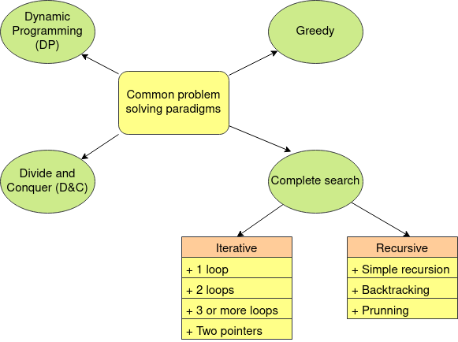

```{r setup, include=FALSE}
htmltools::tagList(rmarkdown::html_dependency_font_awesome())
```

**Nota:** Algunos términos se dejarán en Inglés por simplicidad en esta
y siguientes clases

<div class="topic">Paradigmas de problem solving</div>

Un paradigma es una manera de resolver problemas. En competitiva hay
4 paradigmas de problem solving fundamentales:



Búsqueda completa es un método general que puede ser usado para resolver casi
cualquier problema computacional. Básicamente se trata de generar todas las
posibles soluciones de un problema para hacer algo con estas soluciones (contar
la cantidad de elementos, encontrar una solución en particular, etc).

Soluciones de búsqueda completa pueden ser encontradas de dos maneras:
iterativas o recursivas. Cuando es iterativo lo puedes encontrar como un solo
loop, dos loops, tres o más loops, usando two pointers, etc. Cuando es
recursivo lo puedes encontrar como una función recursiva simple, como una
función recursiva que busca distintos estados mediante `trial and error`
(backtracking), puede tener prunning para no visitar todos los estados, etc.

Cuando resuelvas un problema de búsqueda completa usarás alguna combinación de
estas estructuras. Sin embargo, cada problema es distinto y deberá atacarse de
manera distinta. No existe una método mágico que funcione para todos los
problemas de búsqueda completa, por eso en clases se irá mostrando técnicas conocidas
para atacar una gran variedad de problemas. El dominar estas técnicas te
ayudará a resolver cada vez una mayor cantidad de problemas y cada vez más
dificiles.

Cuando un problema de búsqueda completa se resuelva de manera iterativa diremos
que tenemos una solución fuerza bruta. Comenzaremos estudiando este paradigma
mostrando distintas técnicas para atacar problemas de fuerza bruta.

<div class="topic">Tripletas pitagóricas</div>

Comencemos resolviendo un problema simple.

Una tripleta pitagótica es una tripleta $(x, y, z)$ que satisface la equación
$x^2 + y^2 = z^2$.

**Problem:** Recibirás un entero $n$. Encuentra la cantidad de tripletas
pitagóricas tal que $1 \leq x, y, z \leq n$. 

$$1 \leq n \leq 10^3$$

### Primera solución

Podemos fijar $x, y, z$ usando tres $fors$ y verificar la ecuación en $O(n^3)$.

```c++
int solution1 (int n) {
  int cnt = 0;
  for (int x = 1; x <= n; x++) {
    for (int y = 1; y <= n; y++) {
      for (int z = 1; z <= n; z++) {
        if (x * x + y * y == z * z) {
          cnt++;
        }
      }
    }
  }
  return cnt;
}
```

### Segunda solución

Podemos fijar $x, y$ y determinar si $\exists \, 1 \leq z \leq n$ que satisface
la equación en $O(n^2).$

```c++
int solution2 (int n) {
  vector <bool> is_sq(n * n + 1, false);
  for (int z = 1; z <= n; z++) {
    is_sq[z * z] = true;
  }
  int cnt = 0;
  for (int x = 1; x <= n; x++) {
    for (int y = 1; y <= n; y++) {
      if (x * x + y * y <= n * n and is_sq[x * x + y * y]) {
        cnt++;
      }
    }
  }
  return cnt;
}
```

### Tercera solución

Si $(x, y, z)$ es una tripleta pitagórica, entonces $(kx, ky, kz), k \in \mathbb{N}$ también es una tripleta pitagórica.

Entonces, si encontramos $(x, y, z) \mid gcd(x, y, z) = 1$, la cantidad de
tripletas $(kx, ky, kz) : 1 \leq kx, ky, kz \leq n$ es $\min(\lfloor n / x \rfloor,
\lfloor n / y \rfloor, \lfloor n / z \rfloor)$.

Además, si $(x, y, z)$ es una tripleta pitagórica y $gcd(x, y, z) = 1$,
entonces $(x, y, z)$ es llamada una tripleta pitagórica primitiva.

Y existe una propiedad (fórmula de Euclides) que nos dice que toda tripleta
pitagórica puede ser representada por un par $(a, b) : 0 < b < a \land gcd(a, b) = 1,$ $a$ y $b$ no ambos impares. Esta representación es de la siguiente manera:

$$x = a^2 - b^2$$
$$y = 2 * a * b$$
$$z = a * a + b * b$$

Entonces podemos generar primitivas $(x, y, z), (y, x, z)$ y contar cuantos de
sus múltiplos cumplen la condición en $O(n \log n)$.

```c++
int solution3 (int n) {
  int cnt = 0;
  for (int a = 1; a * a < n; a++) {
    for (int b = 1; b < a; b++) {
      if (__gcd(a, b) != 1) continue;
      if (a % 2 and b % 2) continue;
      int x = a * a - b * b;
      int y = 2 * a * b;
      int z = a * a + b * b;
      int add = min({n / x, n / y, n / z});
      cnt += 2 * add;
    }
  }
  return cnt;
}
```

[Full code](./code/class-05/pythagorean-triple.cpp)

Como hemos visto, un problema se puede resolver de distintas formas. Eso es
algo interesante, especialmente de los problemas de búsqueda completa, pues con
el conocimiento de algunas técnicas y algo de creatidad se pueden crear
soluciones interesantes. Ahora, discutiremos algunas técnicas conocidas para
atacar problemas de fuerza bruta:

* Fijando variables
* Simulación
* Weak constraints
* Análisis por casos

Y también describiremos brevemente de que trata `prefix sums`

<div class="topic">Fijando variables</div>

Hay una clase de problemas donde tienes algunas equaciones en $m$ variables. En
esas ocaciones, una primera buena idea es intentar una solución fuerza bruta.
Para ello se encuentra el rango de valores que puede tomar cada variable, se
hace un loop for cada una de ellas, se comprueba si las ecuaciones se
satisfacen y se va almacenando las m-tuplas que satisfacen las condiciones.
También, cuando estamos haciendo un `for` sobre una variable, estamos fijando su
valor, asi dentro de cada `for` su valor se vuelve una constante, es decir,
estamos reduciendo el número de variables. Por eso, usualmente $m - 1$ `for`
serán suficientes, pues la última variable suele ser fácil de calcular cuando
las demás ya son constantes.

Por ejemplo, intentemos [este problema](https://codeforces.com/contest/44/problem/B).


**Problemia:** Recibirás $n, a, b, c$ enteros. Debes encontrar

$$|\{(x, y, z) \mid 0 \leq x \leq a \land 0 \leq y \leq b \land 0 \leq z \leq
c \land \frac{x}{2} + y + 2 z = n \}|$$

$$1 \leq n \leq 10^4$$
$$0 \leq a, b, c \leq 5000$$

Podemos identificar que las variables del problema son $x, y, z$ y que si
fijamos dos de estas variables podemos obtener la tercera de la equación,
entonces una solución fuerza bruta con 2 `for` puede resolver el problema.
Ahora, para determinar que variables fijar, siempre prefiere trabajar con
enteros (se entenderá mejor esto en próximas clases), así fijaremos $y, z$ en
$O(b * c)$.


<!-- Begins problem example01 -->
<div class="card" id="example01">

  <!-- begin code -->
  <div class="collapsed code-title" type="button" data-toggle="collapse" data-target="#codeProblemexample01" aria-expanded="false" aria-controls="collapseTwo">
  <!-- title -->
  <i class="fas fa-caret-right"></i> <p class="title">Code</p>
  </div>
  <div id="codeProblemexample01" class="collapse">

```c++
#include <bits/stdc++.h>

#define all(A) begin(A), end(A)
#define rall(A) rbegin(A), rend(A)
#define sz(A) int(A.size())
#define pb push_back
#define mp make_pair

using namespace std;

typedef long long ll;
typedef pair <int, int> pii;
typedef vector <int> vi;
typedef vector <ll> vll;

int main () {
  ios::sync_with_stdio(false); cin.tie(0);
  int n, a, b, c;
  cin >> n >> a >> b >> c;
  int ans = 0;
  for (int z = 0; z <= c; z++) {
    for (int y = 0; y <= b; y++) {
      int left = n - z * 2 - y;
      if (left < 0) continue;
      int x = left * 2;
      if (x <= a) ans++;
    }
  }
  cout << ans << '\n';
  return (0);
}
```

  </div>
  <!-- ends code -->

</div>
<!-- ends problem example01 -->

Puedes practicar con estos problemas:

* [Cut Ribbon](https://codeforces.com/problemset/problem/189/A)
* [Economy Game](https://codeforces.com/contest/681/problem/B)
* [Berry Jam](https://codeforces.com/contest/1278/problem/C)
* [Hot Bath](https://codeforces.com/contest/126/problem/A) (**Challenge**)

<div class="topic">Simulación con fuerza bruta</div>

En esta clase de problema se suele describir un patrón, fórmula de recurencia
or situación que es relativamente sencillo de computar. La clave para estos
problemas suele ser darse cuenta como generar tu espacio de búsqueda y saber
implementar tus ideas.

Por ejemplo, comencemos con [este problema](https://onlinejudge.org/index.php?option=com_onlinejudge&Itemid=8&category=24&page=show_problem&problem=384)

**Problem:** Un *humble number* es un número cuyos únicos factores primos son
$2, 3, 5, 7$. Recibirás un número $n$ y deberás imprimir el $n-th$ humble number.

$$1 \leq n \leq 5842$$

Necesitamos calcular $S = \{2^i \cdot 3 ^j \cdot 5^k \cdot 7 ^l, \quad 0 \leq i, j, k, l \}$. 
Digamos que el máximo valores que computamos es $L$, entonces $i, j, k, l = O(\log L)$.

Así, si fijamos $L$ podemos obtener los elementos de $S$ que son menores a $L$
en $O((\log^4 L))$. Así, podemos probar distintos valores de $L$ hasta que
obtengamos más números que el máximo $n$ que recibimos en nuestra entrada. Ten
cuidado con el overflow.


<!-- Begins problem example02 -->
<div class="card" id="example02">

  <!-- begin code -->
  <div class="collapsed code-title" type="button" data-toggle="collapse" data-target="#codeProblemexample02" aria-expanded="false" aria-controls="collapseTwo">
  <!-- title -->
  <i class="fas fa-caret-right"></i> <p class="title">Code</p>
  </div>
  <div id="codeProblemexample02" class="collapse">

```c++
#include <bits/stdc++.h>

using namespace std;

typedef long long ll;

int main () {
  const ll L = 1e10;
  vector <ll> arr;
  for (ll two = 1; two < L; two *= 2) {
    for (ll three = 1; three < L; three *= 3) {
      for (ll five = 1; five < L; five *= 5) {
        for (ll seven = 1; seven < L; seven *= 7) {
          if (two >= L / three) break;
          ll cur = two * three;
          if (cur >= L / five) break;
          cur *= five;
          if (cur >= L / seven) break;
          cur *= seven;
          arr.push_back(cur);
        }
      }
    }
  }
  sort(begin(arr), end(arr));
  int n;
  while (cin >> n) {
    if (n == 0) break;
    string pos;
    if (n % 10 == 1 and (n / 10) % 10 != 1) pos = "st";
    else if (n % 10 == 2 and (n / 10) % 10 != 1) pos = "nd";
    else if (n % 10 == 3 and (n / 10) % 10 != 1) pos = "rd";
    else pos = "th";
    cout << "The " << n << pos << " humble number is " << arr[n - 1] << ".\n";
  }
  return (0);
}
```
  </div>
  <!-- ends code -->
</div>
<!-- ends problem example02 -->

Puedes practicar con estos problemas:

* [Primary Arithmetic](https://onlinejudge.org/index.php?option=com_onlinejudge&Itemid=8&category=24&page=show_problem&problem=976)
* [Beautiful Year](https://codeforces.com/contest/271/problem/A)
* [3n + 1 problem](https://onlinejudge.org/index.php?option=com_onlinejudge&Itemid=8&category=24&page=show_problem&problem=36)
* [Link/Cut Tree](https://codeforces.com/contest/614/problem/A)
* [Easy Type Programming](https://codeforces.com/contest/239/problem/B)

<div class="topic">Weak constraints</div>

En esta clase de problemas el enunciado usualemente luce dificil, pero una vez
que identificas el espacio de búsqueda te daras cuenta que el número de
posibles soluciones es pequeño.

For ejemplo, resolvamos [este problema](https://codeforces.com/contest/817/problem/C).

**Problema:** Encuentra

$$|\{x \leq n \mid x - f(x) \geq s\}|$$

Donde $f(x) =$ suma de dígitos de $x$.

$$1 \leq n, s \leq 10^{18}$$

A primera vista el problema luce dificil, pero tenemos:

$$0 \leq f(x) \leq 9 * 18$$
$$\to x - 9 * 18 \leq x - f(x) \leq 9 * 18$$

Encontes, solo necesitamos buscar la respuesta en $[s, s + 9 * 18]$. ¿Qué pasa
si un número es mayor que $s + 9 * 18$?

<!-- Begins problem example03 -->
<div class="card" id="example03">
  <!-- begin code -->
  <div class="collapsed code-title" type="button" data-toggle="collapse" data-target="#codeProblemexample03" aria-expanded="false" aria-controls="collapseTwo">
  <!-- title -->
  <i class="fas fa-caret-right"></i> <p class="title">Code</p>
  </div>
  <div id="codeProblemexample03" class="collapse">
```c++
#include <bits/stdc++.h>

using namespace std;

typedef long long ll;

const int MX_SUM = 9 * 18;

int sumOfDigits (ll num) {
  int ret = 0;
  while (num) ret += (num % 10), num /= 10;
  return ret;
}

int main () {
  ll n, s;
  cin >> n >> s;
  ll ans = 0, k;
  for (k = s; k <= min(n, s + MX_SUM); k++) {
    if (k - sumOfDigits(k) >= s) ans++;
  }
  ans += max(0LL, n - k + 1);
  cout << ans << endl;
  return (0);
}
```
  </div>
  <!-- ends code -->
</div>
<!-- ends problem example05 -->

La clave para resolver este tipo de problemas es identificar que el espacio de
búsqueda es pequeño debido a alguna propiedad o que una de las variables de la
entrada es pequeña y que podemos intentar una solución fuera bruta sobre ella.

<div class="topic">Análisis por casos</div>

Este tipo de problemas suelen parecer complicados, pero cuando analizar los
casos que pueden ocurrir te das cuenta que el problema se reduce a algo mucho
más simple. 

Por ejemplo, analicemos [este problema](https://codeforces.com/problemset/problem/252/B).

**Problema:** Te dan un array $a$ de $n$ elementos. Imprime dos números $i, j \mid a_i \not = a_j \land i < j$ tal que cuando intercambiamos $a_i, a_j$ el array no esta ordenado (de forma ascendente ni descendente) o imprime -1 si tal par de números no existe.


$$1 \leq n \leq 10^5$$

Una primera idea sería fijar $i, j$ con dos $for$ y verificar si las
condiciones se cumplen. Esta solución es $O(n^3)$, por eso así obtendriamos un TLE. Necesitamos algo mejor.

Analicemos el problema por casos de acuerdo a la cantidad de elementos
distintos que tiene el array.

* Caseo 1: Todos los elementos son iguales

Entonces, la respues es -1.

* Caso 2: Hay más de 2 elementos diferentes.

Puedes tomar 3 elementos distintos cualquiera y encontrarás una respuesta en
ellos (¿puedes probarlo?).

* Caso 3: Hay exactamente 2 elementos diferentes.

  Fijemos $x = a_i$ y $y = a_j$.

  - Caso 3.1: $a_i < a_j$
  
  Si los intercambiamos el array no puede estar en orden creciente. Si el array
  no está en orden decreciente, entonces tenemos una respuesta, sino el array
  tiene la forma:
  
  $$a_1 = y \geq a_2 = y \geq \dots \geq a_i = y \geq \dots \geq a_j = x \geq \dots \geq a_n =x$$
  
  Entonces, si existe una respuesta, esta debe estar en $[i, j)$ o $(i, j]$.
  Así, solo necesitamos verificar un par de enteros $(i, i - 1) \mid a_i < a_{i+ 1}$.
  
  - Caso 3.2: $a_i > a_j$
  
  Si los intercambiamos el array no puede estar en orden decreciente. Si el array
  no está en orden creciente, entonces tenemos una respuesta, sino el array
  tiene la forma:
 
  $$a_1 = x \leq a_2 = x \leq \dots \leq a_i = x \leq \dots \leq a_j = y \leq \dots \leq a_n =y$$
  
  Entonces, si existe una respuesta, esta debe estar en $[i, j)$ o $(i, j]$.
  Así, solo necesitamos verificar un par de enteros $(i, i - 1) \mid a_i > a_{i+ 1}$.


  Usando todos estos casos podemos implementar una solución en $O(n \log n)$.


<!-- Begins problem example05 -->
<div class="card" id="example05">
  <!-- begin code -->
  <div class="collapsed code-title" type="button" data-toggle="collapse" data-target="#codeProblemexample05" aria-expanded="false" aria-controls="collapseTwo">
  <!-- title -->
  <i class="fas fa-caret-right"></i> <p class="title">Code</p>
  </div>
  <div id="codeProblemexample05" class="collapse">
```c++
#include <bits/stdc++.h>

using namespace std;

int main () {
  int n;
  cin >> n;
  set <int> values;
  map <int, int> pos;
  vector <int> a(n);
  for (int i = 0; i < n; i++) {
    cin >> a[i];
    pos[a[i]] = i;
    values.insert(a[i]);
  }
  if (values.size() == 1) {
    cout << -1 << '\n';
    return (0);
  }
  vector <int> a_inc = a;
  vector <int> a_dec = a;
  sort(begin(a_inc), end(a_inc));
  sort(begin(a_dec), end(a_dec));
  reverse(begin(a_dec), end(a_dec));
  if (values.size() > 2) {
    vector <int> arr;
    for (auto pp: pos) {
      arr.push_back(pp.second);
    }
    for (int i = 0; i < 3; i++) {
      for (int j = i + 1; j < 3; j++) {
        int x = arr[i];
        int y = arr[j];
        swap(a[x], a[y]);
        if (a != a_inc and a != a_dec) {
          cout << 1 + min(x, y) << ' ' << 1 + max(x, y) << '\n';
          return (0);
        }
        swap(a[x], a[y]);
      }
    }
  }
  for (int i = 0; i + 1 < n; i++) {
    if (a[i] < a[i + 1]) {
      swap(a[i], a[i + 1]);
      if (a != a_dec) {
        cout << 1 + i << ' ' << 1 + i + 1 << '\n';
        return (0);
      }
      swap(a[i], a[i + 1]);
      break;
    }
  }
  for (int i = 0; i + 1 < n; i++) {
    if (a[i] > a[i + 1]) {
      swap(a[i], a[i + 1]);
      if (a != a_inc) {
        cout << 1 + i << ' ' << 1 + i + 1 << '\n';
        return (0);
      }
      swap(a[i], a[i + 1]);
      break;
    }
  }
  cout << -1 << '\n';
  return (0);
}
```
  </div>
  <!-- ends code -->
</div>
<!-- ends problem example05 -->


Puedes practicar con estos problemas:

* [Shawarma Tent](https://codeforces.com/contest/1271/problem/C)
* [Interesting Subarray](https://codeforces.com/contest/1270/problem/B)
* [Divide by Three](https://codeforces.com/contest/792/problem/C) (**Challenge**)

<div class="topic">Extra: Prefix sums</div>

`Prefix sums` es una técnica simple, pero poderosa.

Veamosla en [este problema](https://www.spoj.com/problems/CSUMQ/).

**Problema:** Recibirás un array de $N$ elementos y $Q$ consultas. Cada
consulta es un rango $l, r$. Por cada consulta imprime the suma de elementos
del array en las posiciones $[l, r]$.

Sea $prefix(x) = a_0 + a_1 + a_2 + \dots + a_x$ y $prefix(-1) = 0$. Entonces:

$\displaystyle\sum_{i=l}^{r}a_i = prefix(r) - prefix(l - 1)$.

Entonces, podemos calcular $prefix$ usando un array en $O(n)$ y responder cada
consulta en $O(1)$ resolviendo así el problema en $O(n + q)$.

<!-- Begins problem exampleextra -->
<div class="card" id="exampleextra">
  <!-- begin code -->
  <div class="collapsed code-title" type="button" data-toggle="collapse" data-target="#codeProblemexampleextra" aria-expanded="false" aria-controls="collapseTwo">
  <!-- title -->
  <i class="fas fa-caret-right"></i> <p class="title">Code</p>
  </div>
  <div id="codeProblemexampleextra" class="collapse">
```c++
#include <bits/stdc++.h>
 
using namespace std;
 
typedef long long ll;
 
int n;
vector <ll> prefix;
 
ll get (int pos) {
  if (pos == -1) return 0;
  return prefix[pos];
}
 
int main () {
  cin >> n;
  prefix.resize(n);
  for (int i = 0; i < n; i++) {
    int a;
    cin >> a;
    prefix[i] = a + get(i - 1);
  }
  int q;
  cin >> q;
  while (q--) {
    int l, r;
    cin >> l >> r;
    cout << get(r) - get(l - 1) << '\n';
  }
  return (0);
}
```
  </div>
  <!-- ends code -->
</div>
<!-- ends problem exampleextra -->

Puedes practicar con estos problemas:

* [Nikita and string](https://codeforces.com/contest/877/problem/B)
* [Intense Heat](https://codeforces.com/contest/1003/problem/C)

Lecturas recomendadas:

* [Notas de fuerza bruta](https://gist.github.com/miguelAlessandro/f588d159a768dc43cc1ec9b81b27bd57)
* [PCUNI-2019 Clase 05](https://nbviewer.jupyter.org/github/TISparta/pcuni-2019/blob/master/clase-05/clase-05.ipynb)
* [Topcoder - Representation of integers and reals section 1](https://www.topcoder.com/community/competitive-programming/tutorials/representation-of-integers-and-reals-section-1/)
* [Topcoder - Representation of integers and reals section 2](https://www.topcoder.com/community/competitive-programming/tutorials/representation-of-integers-and-reals-section-2/)

<div class="topic" id="contest">Contest</div>

El contest lo puedes encontrar [aquí](https://vjudge.net/contest/353302).

<!-- Begins problem A -->
<div class="card" id="problemA">
<div class="collapsed solution-title" type="button" data-toggle="collapse" data-target="#collapseProblemA" aria-expanded="false" aria-controls="collapseTwo">
<!-- title -->
  <i class="fas fa-caret-right"></i> <p class="title">A: Simple Equations</p>
</div>
<!-- begin body -->
<div id="collapseProblemA" class="collapse">
<div class="card-body solution-body">

### <a href="https://onlinejudge.org/index.php?option=com_onlinejudge&Itemid=8&page=show_problem&problem=2612" target="_blank">Simple Equations</a>
$$0 \leq x^2 \quad \forall x \in \mathbb{N}$$
$$\to x^2 \leq x^2 + y^2 + z^2 = C$$
$$x^2 \leq C$$
$$|x| \leq \sqrt{C}$$
$$-\sqrt{C} \leq x \leq \sqrt{C}$$

Lo mismo se cumple para $y$ y $z$. Además si tenemos $x, y$, entonces

$z = A - x - y$. De esta manera, podemos fijar $x, y$ en $O(\sqrt{C}^2) = O(C)$ y chequear si las ecuaciones se cumplen en $O(1)$. 
No te olvides que $x, y, z$ deben ser distintos.

  <!-- begin code -->
  <div class="collapsed code-title" type="button" data-toggle="collapse" data-target="#codeProblemA" aria-expanded="false" aria-controls="collapseTwo">
  <!-- title -->
  <i class="fas fa-caret-right"></i> <p class="title">Code</p>
  </div>
  <div id="codeProblemA" class="collapse">
```c++
#include <bits/stdc++.h>

using namespace std;

void solve (int A, int B, int C) {
  int lim = sqrt(C) + 1;
  for (int x = -lim; x <= lim; x++) {
    for (int y = -lim; y <= lim; y++) {
      int z = A - x - y;
      if (x == y or x == z or y == z) continue;
      if ((x + y + z == A) and
          (x * y * z == B) and
          (x * x + y * y + z * z == C)) {
        cout << x << ' ' << y << ' ' << z << '\n';
        return;
      }
    }
  }
  cout << "No solution.\n";
}

int main () {
  int tc;
  cin >> tc;
  while (tc--) {
    int A, B, C;
    cin >> A >> B >> C;
    solve(A, B, C);
  }
  return (0);
}
```
  </div>
  <!-- ends code -->
</div>
</div>
</div>
<!-- ends problem A -->


<!-- Begins problem B -->
<div class="card" id="B">
<div class="collapsed solution-title" type="button" data-toggle="collapse" data-target="#collapseProblemB" aria-expanded="false" aria-controls="collapseTwo">
<!-- title -->
  <i class="fas fa-caret-right"></i> <p class="title">B: 2Char</p>
</div>
<!-- begin body -->
<div id="collapseProblemB" class="collapse">
<div class="card-body solution-body">

### <a href="https://codeforces.com/problemset/problem/593/A" target="_blank">2Char</a>

La clave de este problema es darse cuenta cuál es el espacio de búsqueda. Como
cada texto tendrá como máximo dos caracteres distintos y el máximo tamaño
posible podemos fijar cuales serán los dos caracteres y solo tomar las cadenas
que solo tengan esos caracteres.

  <!-- begin code -->
  <div class="collapsed code-title" type="button" data-toggle="collapse" data-target="#codeProblemB" aria-expanded="false" aria-controls="collapseTwo">
  <!-- title -->
  <i class="fas fa-caret-right"></i> <p class="title">Code</p>
  </div>
  <div id="codeProblemB" class="collapse">

```c++
#include <bits/stdc++.h>

using namespace std;

const int MAX_N = 110;

int n, ans;
string word[MAX_N];

bool isValid (int id, char ch_1, char ch_2) {
  for (int pos = 0; pos < word[id].size(); pos++) {
    if (word[id][pos] != ch_1 and word[id][pos] != ch_2) {
      return false;
    }
  }
  return true;
}

int main () {
  cin >> n;
  for (int i = 0; i < n; i++) cin >> word[i];
  for (char ch_1 = 'a'; ch_1 <= 'z'; ch_1++) {
    for (char ch_2 = ch_1; ch_2 <= 'z'; ch_2++) {
      int sum = 0;
      for (int id = 0; id < n; id++) {
        sum += isValid(id, ch_1, ch_2) * word[id].size();
      }
      ans = max(ans, sum);
    }
  }
  cout << ans << endl;
  return (0);
}
```

  </div>
  <!-- ends code -->

</div>
</div>
</div>
<!-- ends problem B -->


<!-- Begins problem C -->
<div class="card" id="C">
<div class="collapsed solution-title" type="button" data-toggle="collapse" data-target="#collapseProblemC" aria-expanded="false" aria-controls="collapseTwo">
<!-- title -->
  <i class="fas fa-caret-right"></i> <p class="title">C: Kaprekar Numbers</p>
</div>
<!-- begin body -->
<div id="collapseProblemC" class="collapse">
<div class="card-body solution-body">

### <a href="https://onlinejudge.org/index.php?option=com_onlinejudge&Itemid=8&page=show_problem&problem=915" target="_blank">Kaprekar Numbers</a>

Podemos preprocesar los números de Kaprekar en $[2, 40000]$ (solo hay 19 de
ellos). Después podemos responder cada query buscando en esos 19 elementos.

  <!-- begin code -->
  <div class="collapsed code-title" type="button" data-toggle="collapse" data-target="#codeProblemC" aria-expanded="false" aria-controls="collapseTwo">
  <!-- title -->
  <i class="fas fa-caret-right"></i> <p class="title">Code</p>
  </div>
  <div id="codeProblemC" class="collapse">

```c++
#include <bits/stdc++.h>
     
#define all(A) begin(A), end(A)
#define rall(A) rbegin(A), rend(A)
#define sz(A) int(A.size())
#define pb push_back
#define mp make_pair
     
using namespace std;
     
typedef long long ll;
typedef pair <int, int> pii;
typedef vector <int> vi;
typedef vector <ll> vll;

const int N = 4e4;
vi kaprekar;

bool isKaprekar (int n) {
  string sq = to_string(n * n);
  for (int i = 0; i + 1 < sz(sq); i++) {
    int l = stoi(sq.substr(0, i + 1));
    int r = stoi(sq.substr(i + 1));
    if (0 < min(l, r) and l + r == n) return true;
  }
  return false;
}

void preprocess () {
  for (int n = 2; n <= N; n++) {
    if (isKaprekar(n)) {
      kaprekar.pb(n);
    }
  }
}

int main () {
  ios::sync_with_stdio(false); cin.tie(0);
  preprocess(); // just 19 elements
  int tc;
  cin >> tc;
  for (int t = 1; t <= tc; t++) {
    int l, r;
    cin >> l >> r;
    vi ans;
    for (int elem: kaprekar) {
      if (l <= elem and elem <= r) {
        ans.pb(elem);
      }
    }
    if (t > 1) cout << '\n';
    cout << "case #" << t << '\n';
    if (ans.empty()) {
      cout << "no kaprekar numbers\n";
    } else {
      for (int elem: ans) {
        cout << elem << '\n';
      }
    }
  }
  return (0);
}
```

  </div>
  <!-- ends code -->

</div>
</div>
</div>
<!-- ends problem C -->


<!-- Begins problem D -->
<div class="card" id="D">
<div class="collapsed solution-title" type="button" data-toggle="collapse" data-target="#collapseProblemD" aria-expanded="false" aria-controls="collapseTwo">
<!-- title -->
  <i class="fas fa-caret-right"></i> <p class="title">D: Ranges</p>
</div>
<!-- begin body -->
<div id="collapseProblemD" class="collapse">
<div class="card-body solution-body">

### <a href="https://www.spoj.com/problems/RRANGE/en/" target="_blank">Ranges</a>

Primero, si tenemos esta suma:

$$l + (l + 1) + (l + 2) + \dots + (r - 1) + (r)$$

Podemos calcularla en $O(1)$ usando esta fórmula:

$$\frac{r \cdot (r + 1)}{2} - \frac{(l - 1) \cdot l}{2}$$

Además, notamos que no podemos procesar cada consulta en $O(N)$ (sino
tendríamos una solución $O(NQ)$ lo cual daría TLE), pero usando la anterior
fórmula podemos responder cada consulta en $O(U)$, así tenemos una solución en
$O(QU)$ lo cual es suficiente.

  <!-- begin code -->
  <div class="collapsed code-title" type="button" data-toggle="collapse" data-target="#codeProblemD" aria-expanded="false" aria-controls="collapseTwo">
  <!-- title -->
  <i class="fas fa-caret-right"></i> <p class="title">Code</p>
  </div>
  <div id="codeProblemD" class="collapse">

```c++
#include <bits/stdc++.h>
 
#define all(A) begin(A), end(A)
#define rall(A) rbegin(A), rend(A)
#define sz(A) int(A.size())
#define pb push_back
#define mp make_pair
 
using namespace std;
 
typedef long long ll;
typedef pair <int, int> pii;
typedef vector <int> vi;
typedef vector <ll> vll;
 
int main () {
  ios::sync_with_stdio(false); cin.tie(0);
  const ll MOD = 10000;
  int n, u, q;
  cin >> n >> u >> q;
  vector <pii> update(u);
  for (int i = 0; i < u; i++) cin >> update[i].first >> update[i].second;
  auto get = [&] (ll x) {
    return x * (x + 1) / 2;
  };
  while (q--) {
    int l, r;
    cin >> l >> r;
    ll ans = 0;
    for (auto pp: update) {
      int L = max(pp.first, l);
      int R = min(pp.second, r);
      if (L <= R) {
        ll x = L - pp.first + 1;
        ll y = R - pp.first + 1;
        ans += get(y) - get(x - 1);
        ans %= MOD;
      }
    }
    cout << ans << '\n';
  }
  return (0);
}
```

  </div>
  <!-- ends code -->

</div>
</div>
</div>
<!-- ends problem D -->


<!-- Begins problem E -->
<div class="card" id="E">
<div class="collapsed solution-title" type="button" data-toggle="collapse" data-target="#collapseProblemE" aria-expanded="false" aria-controls="collapseTwo">
<!-- title -->
  <i class="fas fa-caret-right"></i> <p class="title">E: Classroom Watch</p>
</div>
<!-- begin body -->
<div id="collapseProblemE" class="collapse">
<div class="card-body solution-body">

### <a href="https://codeforces.com/problemset/problem/876/C" target="_blank">Classroom Watch</a>

Sea $f(x) =$ suma de dígitos de $x$.

Por los límites del problema tenemos que $0 \leq f(x) \leq 9 \cdot 9$.
Entonces, tenemos:

$$\max(0, n - 9 \cdot 9) \leq x \leq n$$

Así, nuestro espacio de búsqueda es muy pequeño, por lo que podemos simplemente
hacer una búsqueda en ese intervalo.

  <!-- begin code -->
  <div class="collapsed code-title" type="button" data-toggle="collapse" data-target="#codeProblemE" aria-expanded="false" aria-controls="collapseTwo">
  <!-- title -->
  <i class="fas fa-caret-right"></i> <p class="title">Code</p>
  </div>
  <div id="codeProblemE" class="collapse">

```c++
#include <bits/stdc++.h>

using namespace std;

int sumOfDigits (int p) {
  int ret = 0;
  while (p) ret += (p % 10), p /= 10;
  return ret;
}

int main () {
  int n;
  vector <int> ans;
  cin >> n;
  for (int p = max(0, n - 9 * 9); p <= n; p++) if (p + sumOfDigits(p) == n) ans.push_back(p);
  cout << ans.size() << endl;
  for (auto x: ans) cout << x << endl;
  return (0);
}
```

  </div>
  <!-- ends code -->

</div>
</div>
</div>
<!-- ends problem E -->


<!-- Begins problem F -->
<div class="card" id="F">
<div class="collapsed solution-title" type="button" data-toggle="collapse" data-target="#collapseProblemF" aria-expanded="false" aria-controls="collapseTwo">
<!-- title -->
  <i class="fas fa-caret-right"></i> <p class="title">F: Hyperset</p>
</div>
<!-- begin body -->
<div id="collapseProblemF" class="collapse">
<div class="card-body solution-body">

### <a href="https://codeforces.com/problemset/problem/1287/B" target="_blank">Hyperset</a>

Si fijamos dos cartas podemos determinar cual debe ser la tercera. Ten cuidado
con la implementación.

  <!-- begin code -->
  <div class="collapsed code-title" type="button" data-toggle="collapse" data-target="#codeProblemF" aria-expanded="false" aria-controls="collapseTwo">
  <!-- title -->
  <i class="fas fa-caret-right"></i> <p class="title">Code</p>
  </div>
  <div id="codeProblemF" class="collapse">

```c++
#include <bits/stdc++.h>

#define all(A) begin(A), end(A)
#define rall(A) rbegin(A), rend(A)
#define sz(A) int(A.size())
#define pb push_back
#define mp make_pair

using namespace std;

typedef unsigned long long ll;
typedef pair <int, int> pii;

int main () {
  ios::sync_with_stdio(false); cin.tie(0);
  int n, k;
  cin >> n >> k;
  vector <string> arr(n);
  map <string, int> mp;
  for (int i = 0; i < n; i++) {
    cin >> arr[i], mp[arr[i]]++;
  }
  ll ans = 0;
  for (int i = 0; i < n; i++) {
    for (int j = i + 1; j < n; j++) {
      string need = string(k, ' ');
      for (int t = 0; t < k; t++) {
        if (arr[i][t] == arr[j][t]) {
          need[t] = arr[i][t];
        } else {
          if ('S' != arr[i][t] and 'S' != arr[j][t]) need[t] = 'S';
          if ('E' != arr[i][t] and 'E' != arr[j][t]) need[t] = 'E';
          if ('T' != arr[i][t] and 'T' != arr[j][t]) need[t] = 'T';
        }
      }
      ans += mp[need];
    }
  }
  cout << ans / 3 << '\n';
  return (0);
}
```

  </div>
  <!-- ends code -->

</div>
</div>
</div>
<!-- ends problem F -->


<!-- Begins problem G -->
<div class="card" id="G">
<div class="collapsed solution-title" type="button" data-toggle="collapse" data-target="#collapseProblemG" aria-expanded="false" aria-controls="collapseTwo">
<!-- title -->
  <i class="fas fa-caret-right"></i> <p class="title">G: Get AC</p>
</div>
<!-- begin body -->
<div id="collapseProblemG" class="collapse">
<div class="card-body solution-body">

### <a href="https://abc122.contest.atcoder.jp/tasks/abc122_c?lang=en" target="_blank">Get AC</a>

Podemos calcular cuando `AC` hay en un rango usando prefix sums y teniendo
cuidando con los casos borde.

  <!-- begin code -->
  <div class="collapsed code-title" type="button" data-toggle="collapse" data-target="#codeProblemG" aria-expanded="false" aria-controls="collapseTwo">
  <!-- title -->
  <i class="fas fa-caret-right"></i> <p class="title">Code</p>
  </div>
  <div id="codeProblemG" class="collapse">

```c++
#include <bits/stdc++.h>

#define all(A) begin(A), end(A)
#define sz(A) int(A.size())

using namespace std;

typedef long long ll;

int main () {
  ios::sync_with_stdio(false); cin.tie(0);
  int n, q;
  cin >> n >> q;
  string s;
  cin >> s;
  vector <int> ac(n + 1, 0);
  for (int i = 1; i < n; i++) {
    if (s[i - 1] == 'A' and s[i] == 'C') {
      ac[i + 1] = 1;
    }
  }
  for (int i = 1; i <= n; i++) {
    ac[i] += ac[i - 1];
  }
  while (q--) {
    int l, r;
    cin >> l >> r;
    int x = ac[r] - ac[l - 1];
    if (ac[l] - ac[l - 1] == 1) x--;
    cout << x << '\n';
  }
  return (0);
}
```

  </div>
  <!-- ends code -->

</div>
</div>
</div>
<!-- ends problem G -->


