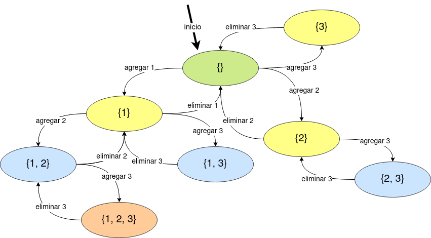
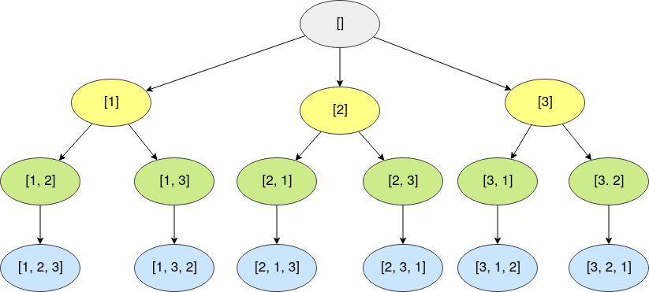
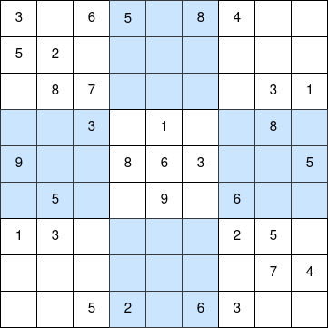
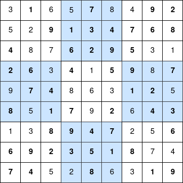
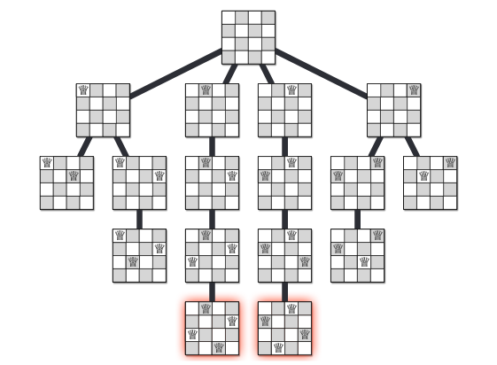

```{r setup, include=FALSE}
htmltools::tagList(rmarkdown::html_dependency_font_awesome())
```

<div class="topic">Conjunto potencia</div>

El conjunto potencia de un conjunto es el conjunto de todos sus subconjuntos. Por ejemplo:

$$A = \{1, 2, 3\}$$
$$P(A) = \{\emptyset, \{1\},  \{2\},  \{3\},  \{1, 2\},  \{2, 3\},  \{1, 3\}, \{1, 2, 3\} \}$$

Donde $P(A)$ representa el conjunto potencia de $A$. Además, tenemos que $|P(A)| = 2^{|A|}$.

**Extra:** En algunos libros, $P(A)$ es escrito como $2^{A}$ (e.g [Motousek - Invitation to Discrete Mathematics](https://www.amazon.com/-/es/Jiri-Matousek/dp/0198570422)).

Podemos generar el conjunto potencia de un conjunto usando recursión, pero
antes de eso recordemos las distintas formas de pasar argumentos a una función
en C++.

```c++
#include <bits/stdc++.h>
     
using namespace std;
     
// Pasamos una referencia a 'arr' en O(1)
// PUEDES leer de 'arr', pero NO PUEDES modificarlo
void f1 (const vector <int>& arr) {

}

// Pasamos una referencia a 'arr' en O(1)
// PUEDES leer de 'arr' y PUEDES modificarlo
void f2 (vector <int>& arr) {
}
     
// Pasamos una copia de 'arr' en O(n)
// PUEDES leer de 'arr' y PUEDES modificarlo
// PERO estas modificando la copia de 'arr', no el 'arr' de 'main'
void f3 (vector <int> arr) {
     
}
     
int main () {
  int n = 10000;
  vector <int> arr(n);
  for (int i = 0; i < n; i++) {
    arr[i] = i;
  }
  f1(arr);
  f2(arr);
  f3(arr);
  return (0);
}
```

Ahora, regresando al problema de generar el conjunto potencia de un conjunto.
Primero, veamos un ejemplo pequeño. Si queremos generar el conjunto potencia de  $A = \{1, 2, 3\}$, podemos escribir una función que siga estos estados:

<div class="row text-center">

</div>

Esto es, si estamos en el estado $(a_1, a_2, \dots a_x) \mid a_1 < a_2 < \dots < a_x$, entonces podemos ir al estado $(a_1, a_2, \dots, a_x, a_y) \mid a_x < a_y \leq n$.

Y podemos implementar esta idea usando recursión así:

  <!-- begin code -->
  <div class="collapsed code-title" type="button" data-toggle="collapse" data-target="#codeProblembacktrack-power-set" aria-expanded="false" aria-controls="collapseTwo">
  <!-- title -->
  <i class="fas fa-caret-right"></i> <p class="title">Code</p>
  </div>
  <div id="codeProblembacktrack-power-set" class="collapse">

```c++
#include <bits/stdc++.h>

using namespace std;

void print (const vector <int>& arr) {
  cout << "{";
  bool first = true;
  for (int elem: arr) {
    if (!first) {
      cout << ", ";
    }
    cout << elem;
    first = false;
  }
  cout << "}\n";
}

void backtrack (vector <int>& arr, const int n) {
  print(arr);
  int ax = 0;
  if (!arr.empty()) {
    ax = arr.back();
  }
  for (int ay = ax + 1; ay <= n; ay++) {
    // agrega ay
    arr.push_back(ay);
    backtrack(arr, n);
    // elimina ay
    arr.pop_back();
  }
}

int main () {
  int n = 3;
  vector <int> subset;
  backtrack(subset, n);
}
```

  </div>
  <!-- ends code -->

Pero, en programación competitiva, es común tratar de tener pocos argumentos en
nuestras funciones, por ello se suele hacer constante uso de variables
globales. Por ejemplo, la anterior solución se puede modificar de esta manera (**¿por qué?**):

  <!-- begin code -->
  <div class="collapsed code-title" type="button" data-toggle="collapse" data-target="#codeProblembacktrack-power-set-global" aria-expanded="false" aria-controls="collapseTwo">
  <!-- title -->
  <i class="fas fa-caret-right"></i> <p class="title">Code</p>
  </div>
  <div id="codeProblembacktrack-power-set-global" class="collapse">

```c++
#include <bits/stdc++.h>

using namespace std;

void print (const vector <int>& arr) {
  cout << "{";
  bool first = true;
  for (int elem: arr) {
    if (!first) {
      cout << ", ";
    }
    cout << elem;
    first = false;
  }
  cout << "}\n";
}

// variables globales
vector <int> subset;
int n;

void backtrack () {
  print(subset);
  int ax = 0;
  if (!subset.empty()) {
    ax = subset.back();
  }
  for (int ay = ax + 1; ay <= n; ay++) {
    // add ay
    subset.push_back(ay);
    backtrack();
    // delete ay
    subset.pop_back();
  }
}

int main () {
  n = 3;
  backtrack();
}
```

  </div>
  <!-- ends code -->

Así, hemos implementado un programa que encuentra el conjunto potencia del
conjunto $\{1, 2, 3, \dots, n\}$ en
$O(n 2 ^ n)$. Las soluciones presentadas han usado una técnica conocida como `backtracking`. En general, una solución backtracking tiene esta forma:

```bw
sea state una variable global

T backtrack (algunos parámetros):
  if (state es un estado terminal):
    Realiza algo con 'state' y retorna algo
  
  for (state' alcanzable desde state):
    # Realiza algo
    previous = state
    state = state'
    backtrack(algunos parámetros')
    # Revierte cambios
    state = previous
```

Un estado terminal es un estado en donde ya no podemos ir a otros estados (o donde no es conveniente seguir buscando).

Veamos como podemos usar esta técnica en [este problema](https://abc125.contest.atcoder.jp/tasks/abc125_b?lang=en).

Podemos tomar los elementos de indices $\{i_1, i_2, \dots, i_k\} \subseteq \{1, 2, 3, \dots, n\}$. Así, podemos buscar la solución en el conjunto potencia de $\{1, 2, 3, \dots, n\}$ usando backtracking.


  <!-- begin code -->
  <div class="collapsed code-title" type="button" data-toggle="collapse" data-target="#codeProblemresale" aria-expanded="false" aria-controls="collapseTwo">
  <!-- title -->
  <i class="fas fa-caret-right"></i> <p class="title">Code</p>
  </div>
  <div id="codeProblemresale" class="collapse">

```c++
#include <bits/stdc++.h>
     
#define all(A) begin(A), end(A)
#define rall(A) rbegin(A), rend(A)
#define sz(A) int(A.size())
#define pb push_back
#define mp make_pair
     
using namespace std;
     
typedef long long ll;
typedef pair <int, int> pii;
typedef vector <int> vi;
typedef vector <ll> vll;

int n;
vi v, c;

int backtrack (int pos, int x, int y) {
  if (pos == n) return x - y;
  return max(backtrack(pos + 1, x + v[pos], y + c[pos]), backtrack(pos + 1, x, y));
}

int main () {
  ios::sync_with_stdio(false); cin.tie(0);
  cin >> n;
  v.resize(n);
  c.resize(n);
  for (int& elem: v) cin >> elem;
  for (int& elem: c) cin >> elem;
  cout << backtrack(0, 0, 0) << '\n';
  return (0);
}
```

  </div>
  <!-- ends code -->


<div class="topic">El problema de la mochila 0-1</div>

**Problema:** Tienes una mochila de capaidad $W$ (i.e puedes poner como máximo
$W$ kg en la mochila). Además, tienes $n$ accesorios. Cada accesorio es
descrito como un par $(val_i, w_i)$, donde $val_i$ es el costo de ese accesorio
y $w_i$ su peso. Encuentra el máximo valor que puedes guardar en la mochila
usando el menor peso posible.

$$1 \leq n \leq 16$$

**Solución:**

Cada accesorio puedes ser tomado o no, entonces podemos buscar por todas las
posibilidades (conjunto potencia) usando backtracking.

  <!-- begin code -->
  <div class="collapsed code-title" type="button" data-toggle="collapse" data-target="#codeProblem0-1-knapsack" aria-expanded="false" aria-controls="collapseTwo">
  <!-- title -->
  <i class="fas fa-caret-right"></i> <p class="title">Code</p>
  </div>
  <div id="codeProblem0-1-knapsack" class="collapse">

```c++
#include <bits/stdc++.h>

using namespace std;

int n;
int W;
vector <int> val;
vector <int> w;
vector <int> take;
int max_sum_val = 0;
int min_sum_w = 0;
vector <int> ans_items_taken;

void backtrack (int last_taken, int sum_val, int sum_w) {
  if (sum_w <= W and (sum_val > max_sum_val or
      (sum_val == max_sum_val and sum_w < min_sum_w))) {
    max_sum_val = sum_val;
    min_sum_w = sum_w;
    ans_items_taken = take;
  }
  for (int i = last_taken + 1; i < n; i++) {
    take.push_back(i);
    backtrack(i, sum_val + val[i], sum_w + w[i]);
    take.pop_back();
  }
}

int main () {
  n = 3;
  W = 10;
  // item 1
  val.push_back(10);
  w.push_back(10);
  // item 2
  val.push_back(1);
  w.push_back(8);
  // item 3
  val.push_back(13);
  w.push_back(2);
  backtrack(-1, 0, 0);

  cout << "Take items";
  for (int item: ans_items_taken) {
    cout << ' ' << item + 1;
  }
  cout << '\n';
  return (0);
}
```

  </div>
  <!-- ends code -->

<div class="topic">Permutaciones</div>

El problema de generar todas las permutaciones puede ser fácilmente  resuelto
en $O(n n!)$ usando backtracking.

  <!-- begin code -->
  <div class="collapsed code-title" type="button" data-toggle="collapse" data-target="#codeProblempermutation" aria-expanded="false" aria-controls="collapseTwo">
  <!-- title -->
  <i class="fas fa-caret-right"></i> <p class="title">Code</p>
  </div>
  <div id="codeProblempermutation" class="collapse">

```c++
#include <bits/stdc++.h>

using namespace std;

int n;
vector <bool> used;
vector <int> permutation;

void print (const vector <int>& p) {
  for (int elem: p) {
    cout << elem << ' ';
  }
  cout << '\n';
}

void backtrack () {
  if (permutation.size() == n) {
    print(permutation);
    return;
  }
  for (int p_i = 1; p_i <= n; p_i++) {
    if (!used[p_i]) {
      used[p_i] = true;
      permutation.push_back(p_i);
      backtrack();
      used[p_i] = false;
      permutation.pop_back();
    }
  }
}

int main () {
  n = 3;
  used.resize(n + 1, false);
  backtrack();
  return (0);
}
```

  </div>
  <!-- ends code -->

Aqui estamos siguiendo estos estados:

<div class="row text-center">

</div>

Esta imagen representa lo que se conoce como el **árbol de recursión**, ese nos
muestra como la función hace las transiciones.

Además, notamos que no necesitamos hacer algo como esto:

```c++
.
.
.
  for (int p_i = 1; p_i <= n; p_i++) {
    if (!used[p_i]) {
      vector <bool> used_previous = used;
      vector <int> permutation_previous = permutation;
      used[p_i] = true;
      permutation.push_back(p_i);
      backtrack();
      used = used_previous;
      permutation = permutation_previous;
    }
  }
.
.
.
```

Porque esto sería más pesado que la primera solucion y porque sabemos que:

* Si antes de llamar a la recursión AGREGAMOS un elemento AL FINAL del vector,
  entonces después de la recursión debemos ELIMINAR EL ÚLTIMO elemento.
* Si anter de llamar a la recursión SETEAMOS A TRUE un elemento, entonces
  despues de la recursión debemos SETEAR A SU VALOR ORIGINAL el elemento.
* Si antes de llamar a la recursión AGREGAMOS algo, entonces después de la
  recursión debemos ELIMINAR lo que agregamos.
* Siguiendo esta lógica, si antes de llamar a la función recursiva HACEMOS UNA
  OPERACIÓN, entonces después de la recursión debemos REVERTIR LA OPERACIÓN.

De estas observaciones notamos que cuando en tu recursión estás en
`estado` y vas a `state'`, entonces después de recorrer el árbol de recursion
de `state'` debes tener las variables en el mismo estado previo a comenzar la
recursión por el árbol de `state'`. Entender estas observaciones es clave para
entender backtracking.

<div class="topic">Sudoku</div>

Con backtracking es fácil generar todas los posibles movimientos de un juego
y escoger el mejor movimiento.

**Problema:**

<div class="row text-center">

</div>

Completa el sudoku de arriba de tal manera que cada número del 1 al 9 es
encontrado solo una vez en cada fila, columna y cuadrante.

**Solución:** Podemos buscar todas las posibilidades usando backtracking.

  <!-- begin code -->
  <div class="collapsed code-title" type="button" data-toggle="collapse" data-target="#codeProblemsudoku" aria-expanded="false" aria-controls="collapseTwo">
  <!-- title -->
  <i class="fas fa-caret-right"></i> <p class="title">Code</p>
  </div>
  <div id="codeProblemsudoku" class="collapse">

```c++
#include <bits/stdc++.h>

using namespace std;

vector <vector <int>> sudoku;
vector <vector <int>> sudoku_solved;
vector <vector <pair <int, int>>> quadrant;
int n;
int N;
bool found;

bool validInRow (int r, int d) {
  for (int c = 0; c < N; c++) {
    if (sudoku[r][c] == d) return false;
  }
  return true;
}

bool validInCol (int c, int d) {
  for (int r = 0; r < N; r++) {
    if (sudoku[r][c] == d) return false;
  }
  return true;
}

bool validInQuadrant (int q, int d) {
  for (pair <int, int> pos: quadrant[q]) {
    int r = pos.first;
    int c = pos.second;
    if (sudoku[r][c] == d) return false;
  }
  return true;
}

// corre esta funcion for cada 0 <= r < N and 0 <= c < N
// y entederás que es lo que hace
int getQuadrant (int r, int c) {
  return (r / n) * n + (c / n);
}

void backtrack (int r, int c) {
  if (r == N) {
    found = true;
    sudoku_solved = sudoku;
    return;
  }
  if (found) {
    return;
  }
  int nc = (c + 1 == N) ? 0 : c + 1; // new column
  int nr = (c + 1 == N) ? r + 1 : r; // new row
  if (sudoku[r][c] != 0) {
    backtrack(nr, nc);
    return;
  } 
  for (int d = 1; d <= 9; d++) {
    int quadrant = getQuadrant(r, c);
    if (validInRow(r, d) and
        validInCol(c, d) and
        validInQuadrant(getQuadrant(r, c), d)) {
      sudoku[r][c] = d;
      backtrack(nr, nc);
      sudoku[r][c] = 0;
    }
  }
}

void precomputation () {
  found = false;
  N = sudoku.size();
  n = 1;
  while ((n + 1) * (n + 1) <= N) n++;
  // n = sqrt(N)
  quadrant.resize(N);
  for (int r = 0; r < N; r++) {
    for (int c = 0; c < N; c++) {
      quadrant[getQuadrant(r, c)].push_back({r, c});
    }
  }
}

void print (const vector <vector <int>>& sudoku) {
  for (auto row: sudoku) {
    for (int elem: row) {
      cout << elem << ' ';
    }
    cout << '\n';
  }
}

int main () {
  sudoku = {
            {3, 0, 6, 5, 0, 8, 4, 0, 0},  
            {5, 2, 0, 0, 0, 0, 0, 0, 0},  
            {0, 8, 7, 0, 0, 0, 0, 3, 1},  
            {0, 0, 3, 0, 1, 0, 0, 8, 0},  
            {9, 0, 0, 8, 6, 3, 0, 0, 5},  
            {0, 5, 0, 0, 9, 0, 6, 0, 0},  
            {1, 3, 0, 0, 0, 0, 2, 5, 0},  
            {0, 0, 0, 0, 0, 0, 0, 7, 4},  
            {0, 0, 5, 2, 0, 6, 3, 0, 0}
           };
  precomputation();
  backtrack(0, 0);
  print(sudoku_solved);
  return (0);
}
```

  </div>
  <!-- ends code -->

Con este código podemos obtener esta solución:

<div class="row text-center">

</div>

<div class="topic">El problema de las N-reinas</div>

**[Problema:](https://www.hackerearth.com/practice/basic-programming/recursion/recursion-and-backtracking/tutorial/)** 

Dado un tablero de ajedrez de $N \times N$ celdas, debes colocar $N$ reinas
en el tablero de tal manera que no se ataquen.

$$1 \leq N \leq 10$$

**Recuerda:** Una reina puede atacar en toda una fila, columna o diagonal.

**Solución:** Podemos intentar poner $N$ reinas en las $N \times N$ celdas. De
esta manera tendríamos $\binom{N \times N}{N}$ estados que verificar. Pero para
$N = 8$ tenemos $\binom{N \times N}{N} \approx 8B$ estados, entonces
necesitamos un mejor enfoque.

Sabemos que cada reina debe estar en distintas columnas (sino ellas se estarían
atacando entre sí). Entonces podemos generar estas $N^N$ configuraciones
y revisar si las condiciones se cumplen. Pero para este problema este enfoque
no es suficiente.

Analizando un poco nos damos cuenta que cada reina debe estar en una fila
y columna distinta. Así, las filas de las posiciones de las reinas en una
configuración válida forman son una permutación de $\{ 1, 2, \dots, n }$, lo
mismo se cumple con las columnas. De este modo, tenemos $N!$ posibles
configuraciones que revisar y podemos implementar este enfoque con
backtracking.

  <!-- begin code -->
  <div class="collapsed code-title" type="button" data-toggle="collapse" data-target="#codeProblemn-queen" aria-expanded="false" aria-controls="collapseTwo">
  <!-- title -->
  <i class="fas fa-caret-right"></i> <p class="title">Code</p>
  </div>
  <div id="codeProblemn-queen" class="collapse">

```c++
#include <bits/stdc++.h>

using namespace std;

int n;
vector <pair <int, int>> queen;
vector <pair <int, int>> solution;

bool valid (int r, int c) {
  for (auto pp: queen) {
    // if same row or same column or same diagonal
    if ((pp.first == r) or
        (pp.second == c) or
        (abs(r - pp.first) == abs(c - pp.second))) {
      return false;
    }
  }
  return true;
}

void backtrack (int r) {
  if (r == n) {
    solution = queen;
    return;
  }
  if (!solution.empty()) {
    return;
  }
  for (int c = 0; c < n; c++) {
    if (valid(r, c)) {
      queen.push_back({r, c});
      backtrack(r + 1);
      queen.pop_back();
    }
  }
}

int main () {
  cin >> n;
  backtrack(0);
  if (solution.empty()) {
    cout << "NO\n";
    return (0);
  }
  vector <vector <int>> board(n, vector <int> (n, 0));
  for (auto pp: solution) {
    board[pp.first][pp.second] = 1;
  }
  cout << "YES\n";
  for (int r = 0; r < n; r++) {
    for (int c = 0; c < n; c++) {
      cout << board[r][c] << " \n"[c == n - 1];
    }
  }
  return (0);
}
```

  </div>
  <!-- ends code -->

Para $N = 4$ el árbol de recursión de nuestra solución luce así:

<div class="row text-center">

</div>

Imagen tomada de [Jeff Erickson - Algorithms - Chapter 2: Backtracking](http://jeffe.cs.illinois.edu/teaching/algorithms/).

La complejidad de la anterior solución viene de la equación:

$$T_n = n \cdot T_{n - 1} + O(n)$$
$$\to T_n = O(n!)$$

Así, nuestra solución tiene complejidad $O(n!)$.

Lecturas recomendadas:

* [HackerEarth - Recursion and Backtracking](https://www.hackerearth.com/practice/basic-programming/recursion/recursion-and-backtracking/tutorial/)
* Competitive Programming 3, secciones 3.2.2, 8.2.1 and 8.2.2.
* [GeekForGeeks - Backtracking Algorithms](https://www.geeksforgeeks.org/backtracking-algorithms/)

También te podría interesar ver este documental de AlphaGo. [Aquí](https://youtu.be/8tq1C8spV_g) está el trailler.

<div class="topic" id="contest">Contest</div>

El contest lo puedes encontrar [aquí](https://vjudge.net/contest/355270).

<!-- Begins problem A -->
<div class="card" id="A">
<div class="collapsed solution-title" type="button" data-toggle="collapse" data-target="#collapseProblemA" aria-expanded="false" aria-controls="collapseTwo">
<!-- title -->
  <i class="fas fa-caret-right"></i> <p class="title">A: CD</p>
</div>
<!-- begin body -->
<div id="collapseProblemA" class="collapse">
<div class="card-body solution-body">

### <a href="https://onlinejudge.org/index.php?option=com_onlinejudge&Itemid=8&page=show_problem&problem=565" target="_blank">CD</a>

Cada elemento puede o no ser tomado, entonces podemos implementar una solución
backtracking; además, de esta manera podemos mantener el orden inicial de los
elementos.

  <!-- begin code -->
  <div class="collapsed code-title" type="button" data-toggle="collapse" data-target="#codeProblemA" aria-expanded="false" aria-controls="collapseTwo">
  <!-- title -->
  <i class="fas fa-caret-right"></i> <p class="title">Code</p>
  </div>
  <div id="codeProblemA" class="collapse">

```c++
#include <bits/stdc++.h>
     
using namespace std;
 
int main () {
  int n;
  while (cin >> n) {
    int m;
    cin >> m;
    vector <int> arr(m);
    for (int& elem: arr) cin >> elem;
    vector <int> take;
    vector <int> ans;
    int sum = 0;
    int best_sum = 0;

    function <void(int)> backtrack = [&] (int pos) -> void {
      if (sum > best_sum or (sum == best_sum and ans.size() < take.size())) {
        best_sum = sum;
        ans = take;
      }
      if (pos == m) return;
      // do not take it
      backtrack(pos + 1);
      if (sum + arr[pos] > n) return;
      // take it
      take.push_back(arr[pos]);
      sum += arr[pos];
      backtrack(pos + 1);
      take.pop_back();
      sum -= arr[pos];
    };

    backtrack(0);
    for (int elem: ans) cout << elem << ' ';
    cout << "sum:" << best_sum << '\n';
  }
  return (0);
}
```

  </div>
  <!-- ends code -->

</div>
</div>
</div>
<!-- ends problem A -->


<!-- Begins problem B -->
<div class="card" id="B">
<div class="collapsed solution-title" type="button" data-toggle="collapse" data-target="#collapseProblemB" aria-expanded="false" aria-controls="collapseTwo">
<!-- title -->
  <i class="fas fa-caret-right"></i> <p class="title">B: Hanoi Tower Troubles Again!</p>
</div>
<!-- begin body -->
<div id="collapseProblemB" class="collapse">
<div class="card-body solution-body">

### <a href="https://onlinejudge.org/index.php?option=com_onlinejudge&Itemid=8&page=show_problem&problem=1217" target="_blank">Hanoi Tower Troubles Again!</a>

Hay un enfoque greedy: pon el balón en la primera pila donde puedas ponerlo.

  <!-- begin code -->
  <div class="collapsed code-title" type="button" data-toggle="collapse" data-target="#codeProblemB" aria-expanded="false" aria-controls="collapseTwo">
  <!-- title -->
  <i class="fas fa-caret-right"></i> <p class="title">Code</p>
  </div>
  <div id="codeProblemB" class="collapse">

```c++
#include <bits/stdc++.h>

using namespace std;

int main () {
  const int N = 1e5;
  vector <bool> is_sq(N, false);
  for (int i = 0; i * i < N; i++) is_sq[i * i] = true;
  int tc;
  cin >> tc;
  while (tc--) {
    int n;
    cin >> n;
    vector <vector <int>> pile(n);
    int ans = 0;
    int cur = 0;

    function <void(int)> rec = [&] (int num) -> void {
      ans = max(ans, cur);
      for (int i = 0; i < n; i++) {
        if (pile[i].empty() or is_sq[pile[i].back() + num]) {
          cur += 1;
          pile[i].push_back(num);
          rec(num + 1);
          break;
        }
      }
    };

    rec(1);
    cout << ans << '\n';
  }
  return (0);
}
```

  </div>
  <!-- ends code -->

</div>
</div>
</div>
<!-- ends problem B -->


<!-- Begins problem C -->
<div class="card" id="C">
<div class="collapsed solution-title" type="button" data-toggle="collapse" data-target="#collapseProblemC" aria-expanded="false" aria-controls="collapseTwo">
<!-- title -->
  <i class="fas fa-caret-right"></i> <p class="title">C: Marcus</p>
</div>
<!-- begin body -->
<div id="collapseProblemC" class="collapse">
<div class="card-body solution-body">

### <a href="https://onlinejudge.org/index.php?option=com_onlinejudge&Itemid=8&page=show_problem&problem=1393" target="_blank">Marcus</a>

Identifica el punto inicial y luego busca en la matriz usando backtracking.

  <!-- begin code -->
  <div class="collapsed code-title" type="button" data-toggle="collapse" data-target="#codeProblemC" aria-expanded="false" aria-controls="collapseTwo">
  <!-- title -->
  <i class="fas fa-caret-right"></i> <p class="title">Code</p>
  </div>
  <div id="codeProblemC" class="collapse">

```c++
#include <bits/stdc++.h>

using namespace std;

int main () {
  const vector <int> dr = {-1, 0, 0};
  const vector <int> dc = {0, -1, 1};
  const vector <string> option = {"forth", "left", "right"};
  const string word = "IEHOVA#";
  int tc;
  cin >> tc;
  while (tc--) {
    int n, m;
    cin >> n >> m;
    vector <string> ans;
    vector <string> take;
    vector <string> grid(n);
    for (int i = 0; i < n; i++) cin >> grid[i];

    function <void(int,int)> backtrack = [&] (int r, int c) -> void {
      if (take.size() == 7) {
        ans = take;
        return;
      }
      for (int d = 0; d < 3; d++) {
        if (!ans.empty()) return;
        int nr = r + dr[d];
        int nc = c + dc[d];
        if (not (0 <= min(nr, nc) and nr < n and nc < m)) continue;
        if (grid[nr][nc] != word[take.size()]) continue;
        take.push_back(option[d]);
        backtrack(nr, nc);
        take.pop_back();
      }
    };

    for (int r = 0; r < n; r++) {
      for (int c = 0; c < m; c++) {
        if (grid[r][c] == '@') {
          backtrack(r, c);
        }
      }
    }
    for (int i = 0; i < 7; i++) {
      cout << ans[i] << " \n"[i == 6];
    }
  }
  return (0);
}
```

  </div>
  <!-- ends code -->

</div>
</div>
</div>
<!-- ends problem C -->


<!-- Begins problem D -->
<div class="card" id="D">
<div class="collapsed solution-title" type="button" data-toggle="collapse" data-target="#collapseProblemD" aria-expanded="false" aria-controls="collapseTwo">
<!-- title -->
  <i class="fas fa-caret-right"></i> <p class="title">D: Back to the 8-Queens</p>
</div>
<!-- begin body -->
<div id="collapseProblemD" class="collapse">
<div class="card-body solution-body">

### <a href="https://onlinejudge.org/index.php?option=com_onlinejudge&Itemid=8&page=show_problem&problem=2026" target="_blank">Back to the 8-Queens</a>


Solo hay 92 configuraciones válidas, puedes generarlas con backtracking y luego
solo hacer una busqueda lineal por cada test.

  <!-- begin code -->
  <div class="collapsed code-title" type="button" data-toggle="collapse" data-target="#codeProblemD" aria-expanded="false" aria-controls="collapseTwo">
  <!-- title -->
  <i class="fas fa-caret-right"></i> <p class="title">Code</p>
  </div>
  <div id="codeProblemD" class="collapse">

```c++
#include <bits/stdc++.h>

using namespace std;

const int N = 8;
vector <pair <int, int>> queen;
vector <vector <pair <int, int>>> solution;

bool valid (int r, int c) {
  for (auto pp: queen) {
    // if same row or same column or same diagonal
    if ((pp.first == r) or
        (pp.second == c) or
        (abs(r - pp.first) == abs(c - pp.second))) {
      return false;
    }
  }
  return true;
}

void backtrack (int c) {
  if (c == N + 1) {
    solution.push_back(queen);
    return;
  }
  for (int r = 1; r <= N; r++) {
    if (valid(r, c)) {
      queen.push_back({r, c});
      backtrack(c + 1);
      queen.pop_back();
    }
  }
}

int main () {
  backtrack(1);
  vector <int> row(N);
  int tc = 0;
  while (cin >> row[0]) {
    for (int i = 1; i < N; i++) cin >> row[i];
    int ans = INT_MAX;
    for (auto sol: solution) {
      int need = 0;
      for (int i = 0; i < N; i++) {
        need += (row[i] != sol[i].first);
      }
      ans = min(ans, need);
    }
    cout << "Case " << ++tc << ": " << ans << '\n';
  }
  return (0);
}
```

  </div>
  <!-- ends code -->

</div>
</div>
</div>
<!-- ends problem D -->


<!-- Begins problem E -->
<div class="card" id="E">
<div class="collapsed solution-title" type="button" data-toggle="collapse" data-target="#collapseProblemE" aria-expanded="false" aria-controls="collapseTwo">
<!-- title -->
  <i class="fas fa-caret-right"></i> <p class="title">E: Boggle Blitz</p>
</div>
<!-- begin body -->
<div id="collapseProblemE" class="collapse">
<div class="card-body solution-body">

### <a href="https://onlinejudge.org/index.php?option=com_onlinejudge&Itemid=8&page=show_problem&problem=428" target="_blank">Boggle Blitz</a>

Solo implementa una solución backtracking para hacer una búsqueda completa.

  <!-- begin code -->
  <div class="collapsed code-title" type="button" data-toggle="collapse" data-target="#codeProblemE" aria-expanded="false" aria-controls="collapseTwo">
  <!-- title -->
  <i class="fas fa-caret-right"></i> <p class="title">Code</p>
  </div>
  <div id="codeProblemE" class="collapse">

```c++
#include <bits/stdc++.h>

using namespace std;

int main () {
  int tc;
  cin >> tc;
  for (int t = 0; t < tc; t++) {
    if (t) cout << '\n';
    int n;
    cin >> n;
    vector <string> grid(n);
    for (int i = 0; i < n; i++) cin >> grid[i];
    vector <string> ans;
    string word = "";

    function <void(int,int,char)> backtrack = [&] (int r, int c, char last) -> void {
      if (3 <= word.size()) {
        ans.push_back(word);
      }
      for (int dr = -1; dr <= 1; dr++) {
        for (int dc = -1; dc <= 1; dc++) {
          if (dr == 0 and dc == 0) continue;
          int nr = r + dr;
          int nc = c + dc;
          if (not (0 <= min(nr, nc) and max(nr, nc) < n)) continue;
          if (grid[nr][nc] <= last) continue;
          word += grid[nr][nc];
          backtrack(nr, nc, grid[nr][nc]);
          word.pop_back();
        }
      }
    };

    for (int r = 0; r < n; r++) {
      for (int c = 0; c < n; c++) {
        word += grid[r][c];
        backtrack(r, c, grid[r][c]);
        word.pop_back();
      }
    }
    sort(begin(ans), end(ans), [&] (const string& x, const string& y) {
      if (x.size() != y.size()) return x.size() < y.size();
      return x < y;  
    });
    // delete duplicates
    ans.erase(unique(begin(ans), end(ans)), end(ans));
    for (auto& word: ans) cout << word << '\n';
  }
  return (0);
}
```

  </div>
  <!-- ends code -->

</div>
</div>
</div>
<!-- ends problem E -->


