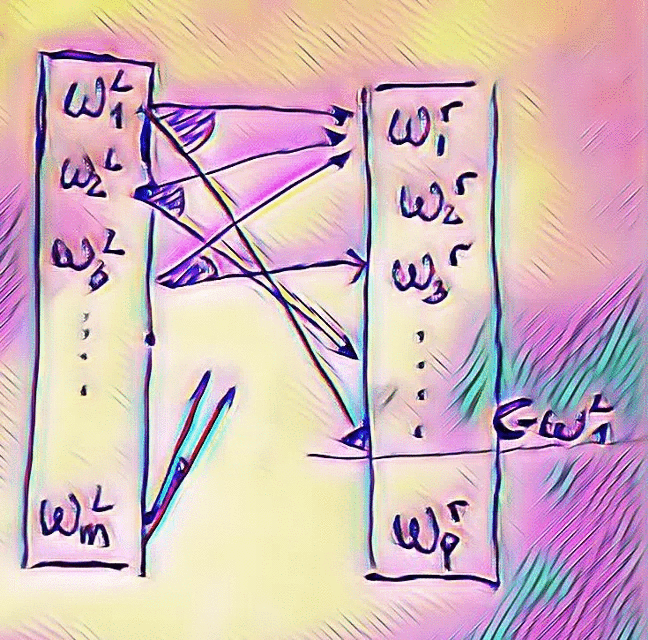

## outline 

  - [¿Qué es meet in the middle?](#1)
    - [Un algoritmo de fuerza bruta más inteligente](#2)
    - [Código](#3)
    - [Nueva Complejidad](#4)
  - [Baby Step Giant Step](#5)
    - [Código asumiendo n: primo $O(\sqrt n \log n)$](#6)
  - [problemas](#7)
  
## ¿Qué es meet in the middle?

Ya hemos estudiado el problema de la mochila, conocemos que este problema
es NP, lo que quiere decir que no exsite una solución determinista y que no
sea exponencial respecto a la cantidad de elementos. 

Problema: Dado $n$ elementos con pesos $w_i$ y valores $v_i$, hallar un 
subconjunto de los elementos tal que su suma de pesos sea a lo mas $C$ y
su valor sea máximo.

$$\max\limits_{i=1}^n ~v_i x_i$$
$$\sum\limits_{i=1}^n w_i x_i \le C$$
$$x_i \in \{0, 1\}$$

En resumen, conocemos que la complejidad es $O$($2^n$) o $O$($2^n n$), según
como se implemente, pero ¿se puede mejorar?. 

### Un algoritmo de fuerza bruta más inteligente

Recordemos que cada conjunto lo podemos ver como un string de 0's y 1's con n
elementos, pero eso nos quiere decir que se puede ver como dos string de 0's y
1's de tamaños $\lfloor \frac{n}{2} \rfloor$ y $\lceil \frac{n}{2} \rceil$,
respectivamente, los cuales hemos unido.

Pero, ¿Cómo unirlos? Supongamos que el primer string tenga suma de pesos asociada
de $W$, entonces, debo encontrar de todos los posibles segundos strings que tengan
suma de pesos a lo más $C - W$ el que tenga mayor suma de valores.

Lo último podría ser también costoso, así que probemos lo siguiente, que sucede
si ordenamos los conjuntos tanto de derecha y de izquierda de forma creciente
respecto a la suma de pesos, sean $W_1^l \le W_2^l \le \dots \le W_m^l$ y 
$W_1^r \le W_2^r \le \dots \le W_p^r$. Entonces, al buscar por $W_1^l$ buscamos 
por todos los que son menores o iguales a $C - W_1^l$ en el lado derecho, eso
quiere decir que al buscar el siguiente en el lado izquierdo, estoy consultando
por menos en el lado derecho. 

<p align="center">
{height=10cm}
</p>

Para finalizar, para poder lograr una buena complejidad, le asignamos al k-ésimo
elemento el máximo posible suma de valores de los k primeros elementos.

### Código

```cpp
#include <bits/stdc++.h>
using namespace std;

int main() {
  inr n, C;
  cin >> n >> C;
  vector<int> w(n), v(n);
  for (int i = 0; i < n; ++i) {
    cin >> w[i] >> v[i];
  }
  int m = n/2, p = (n+1)/2;
  vector<pair<int, int>> L, R;
  for (int s = 0; s < 1<<m; ++s) {
    int W = 0, V = 0;
    for (int i = 0; i < m; ++i) {
      if (s & (1<<i)) {
        W += w[i];
        V += v[i];
      }
    }
    L.push_back({W, V});
  }
  for (int s = 0; s < 1<<p; ++s) {
    int W = 0, V = 0;
    for (int i = 0; i < p; ++i) {
      if (s & (1<<i)) {
        W += w[m + i];
        V += v[m + i];
      }
    }
    R.push_back({W, V});
  }
  sort(L.begin(), L.end());
  sort(R.begin(), R.end());
  int mx = -1e9;
  for (auto& e : R) {
    e.second = max(e.second, mx);
    mx = e.second;
  }
  int ans = -1e9;
  for (int l = 0, r = R.size() - 1; l < L.size(); ++l) {
    while (r > 0 and R[r].first + L[l].first > C) r -= 1;
    if (R[r].first + L[l].first <= C) {
      ans = max(ans, R[r].second + L[l].second);
    }
  }
  cout << ans << endl;
  return 0;
}
```

### Nueva complejidad

Qué tanto ha mejorado la complejidad de nuestro anterior algoritmo?, bueno, 
hemos generado solo conjuntos de a lo más tamaño $\lceil \frac{n}{2} \rceil$
lo que equivale a una complejidad de $O({\sqrt2}^n n)$, y ordenalos toma lo 
mismo, al final hacemos un for y tanto $l$ como $r$ recorren todos los elementos
una vez. por tanto la complejidad es $O({\sqrt2}^n n)$. Por tanto podriamos
abordar problemas con $n = 44$ aproximadamente.

## Baby Step Giant Step

Meet in the middle es un tema relativamente complicado, hay que ser muy ingenioso
para luego de partir el problema, poder unilos.

Problema: Dados $a$, $b$ y $n$ con mcd($a$, $n$) $= 1$ hallar $m$, si existe, 
que cumpla: 
$$a^m \equiv b \mod n$$

En primer lugar $a^m$ no toma muchos valores, es claro que no puede tomar más
de n valores, y todos los valores distintos se pueden hallar en el conjunto 
$\{0, 1, \dots, n-1\}$

Para resolver este problema sin iterar sobre todo $m$, haremos el siguiente
truco: Todo $m$ se puede expresar como $m = d q + r$, con $0 \le r < d$. Lo
que quiere decir que si nosotros escogemos $d = sqrt(n)$, puedo ver que 
$q$ y $r$ no superan $d$.

Eso quiere decir que yo puedo tener el siguiente problema: hallar $q$ y $r$
tal que:

$$a^{d q + r} = b \mod n$$
$$(a^d)^q a^r = b \mod n$$
$$(a^d)^q = b (a^{-1})^r \mod n$$

Esto quiere decir que por cada $(a^d)^q$, debo buscar si existe el mismo valor
expresado como $b(a^{-1})^r$.

### Código asumiendo n: primo $O(\sqrt n \log n)$

```cpp
#include <bits/stdc++.h>
using namespace std;

int mul(long long a, int b, int n) {
  return a * b % n;
}

int ex(int a, int b, int n) {
  int r = 1;
  while (r > 0) {
    if (b&1) r = mul(r, a, n);
    a = mul(a, a, n);
    b >>= 1;
  }
  return r;
}

int baby_step_giant_step(int a, int b, int n) {
  int d = sqrt(n) + 1;
  map<int, int> adq;
  int ad = ex(a, d, n);
  int pot = 1;
  for (int q = 0; q < d; ++q) {
    adq[pot] = q;
    pot = mul(pot, ad);
  }
  int inva = ex(a, n-2, n);
  pot = 1;
  for (int r = 0; r < d; ++r) {
    int t = mul(b, pot);
    if (adq.count(t)) {
      return adq[t] * d + r;
    }
    pot = mul(pot, inva);
  }
  return -1;
}

int main() {
  int a, b, n;
  cin >> a >> b >> n;
  cout << baby_step_giant_step(a, b, n) << endl;
  return 0;
}
```

## problemas:

1. [KnapsackProblem](https://community.topcoder.com/stat?c=problem_statement&pm=6742&rd=10763)

2. [Good Numbers](https://codeforces.com/contest/1249/problem/C2)

3. [Xor-Paths](https://codeforces.com/problemset/problem/1006/F)

4. [Maximum Subsequence](https://codeforces.com/contest/888/problem/E)

5. [Field Expansion](https://codeforces.com/contest/799/problem/D)

6. [Chocolate](https://codeforces.com/problemset/problem/490/D)

7. [Golden System](https://codeforces.com/problemset/problem/457/A)

8. [k-Interesting Pairs Of Integers](https://codeforces.com/problemset/problem/769/D)
